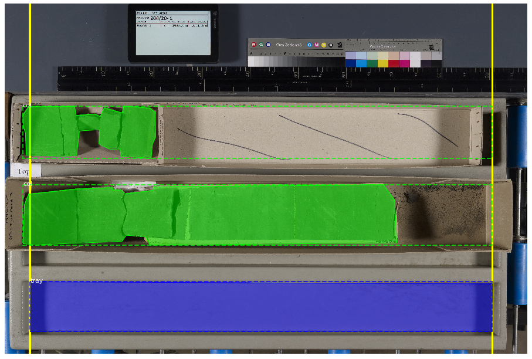

# Layout Parameters

`corebreakout` allows for processing images with different standard layouts, and the use of several different methods for finding and cropping the bounding boxes of individual columns within an image.

Layout parameters are used within the `CoreSegmenter.segment()` method.

Any and all default parameters can be overridden and updated in the `CoreSegmenter` constructor, or in any single call to the `segment()` method. In either case, pass any new parameters in a dict as the `layout_params` keyword argument.


The default parameters reflect the characteristics of the BGS dataset on which the example model is trained:
```python
# corebreakout/defaults.py

LAYOUT_PARAMS = {
  'order' : 't2b',
  'orientation' : 'l2r',
  'col_height' : 1.0,
  'col_class' : 'col',
  'endpts' : 'tray'
}
```

**DEVELOPMENT NOTE:** The only allowed values for `order` and `orientation` are `'t2b'` and `'l2r'`. This covers all conventional core image layouts that we are aware of, but we would consider adding `'b2t'` and `'r2l'` if provided with use-cases. If you have one, please open an issue (or submit a pull request :-).

## `order` and `orientation`

The `'order'` parameter specifies the depth order by which to sort the set of columns detected in an image:
- `'t2b'` implies that columns are laid out horizontally, with the uppermost column coming first in order of depth.
- `'l2r'` implies that columns are laid out vertically, with the leftmost column coming first in order of depth.

The `'orientation'` parameter specifies the depth orientation of columns. This should be the converse of `'order'`:
 - `'t2b'` implies that the top of a (vertical) column is toward the top of the image.
 - `'l2r'` implies that the top of a (horizontal) column is toward the left side of the image.

Since it is required that `order` be one of these options and `orientation` be the other, requiring both *is* redundant. However, making both of them explicit improves code readability, and will make it easier to add other options should we choose to do so in future releases.


## `col_height`

The `'col_height'` parameter specifies the height in depth units (usually meters or feet) of individual (and complete) columns.

This value is used in conjunction with the `depth_range` positional argument to find the number of expected columns in an image when calling `CoreSegmenter.segment(img, depth_range, ...)`.

## `col_class`

The name of the class representing core sample columns in the M-RCNN model used by `CoreSegmenter` instance.

## `endpts`

The `'endpts'` parameter determines the method for making sure that before cropping, the `top` and `base` of partial columns are extended to locations that are approximately `'col_height'` apart. Different options may work better or worse depending on how clean the samples are and how consistent the layout is.

Predicted masks tend to be subsets of the 'true' masks, so **short columns are extended**, but **longer columns are NOT shortened**. You can see this in the example images below, where the computed minimal endpoint locations are shown as solid yellow lines, and the resulting column bounding boxes are shown as green dashed lines.

Allowed values of `'endpts'` include:
- The name of a class (*e.g.*, `'tray'`)
    - Results in columns being extended to the `top` and `base` of the strongest detection of this class
    - Must be found in the `class_names` attribute of the `CoreSegmenter` instance
    - Typical choices would be empty trays, or the measuring sticks commonly placed next to boxes of core



- One of the keywords `'auto'` or `'auto_all'`
    - Results in columns being extended to the min/max coordinates of a set of detected objects
    - `'auto'` will use only objects of `'col_class'` as the relevant set (*e.g.*, all `'col'` detections -- first example below)
    - `'auto_all'` will use all objects in the image (*e.g.*, all `'col'` **and** `'tray'` detections -- second example below)


- A 2-tuple of explicit integer endpoint coordinates (*e.g.*, `(100, 6900)`)
    - Results in columns being extended to at least these min/max coordinates


